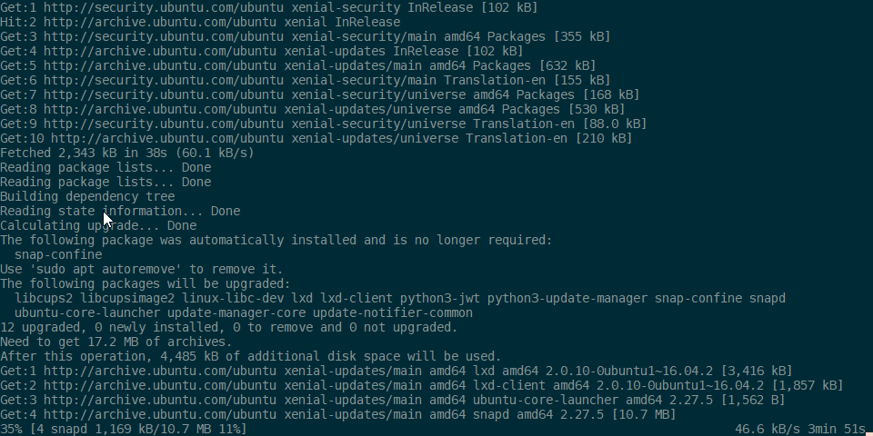
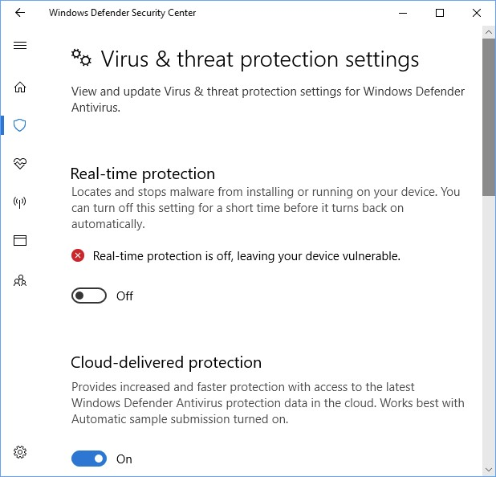
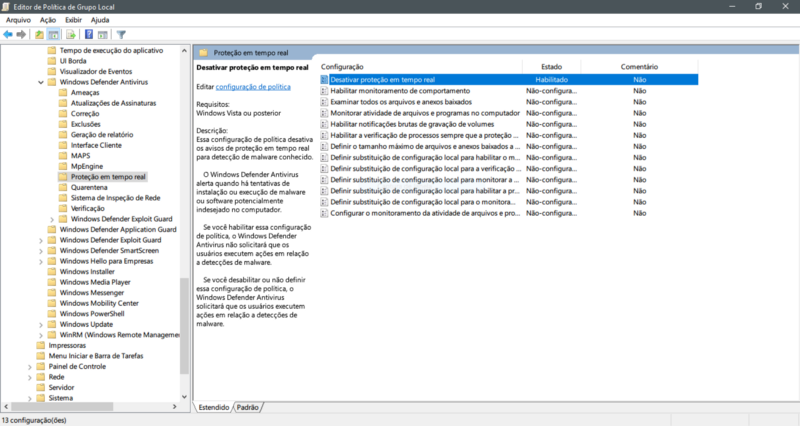

In this short tutorial, I will help you speedup Windows Subsystem for Linux (WSL) by disabling Windows Real-time protection.

While being helpful detecting some common Windows malwares, in GNU/Linux side it’s so inefficient and actually unhelpful.

Every time you try to access/read/write some file/folder, Windows Defender intercept WSL requisition for antivirus scanning, slowing down things until you hate everything in WSL!

**\*Warning**: disabling Real-time Security may have some direct impact in yours personal security\*. Know what you are doing.

<!--more-->

# Adding WSL in the Windows Security's Exclusion List

So, first get the UbuntuOnLinux (or your distro of choice) installation path going to `%USERPROFILE%\AppData\Local\Packages` and lookup for something like `CanonicalGroupLimited.UbuntuonWindows_79rhkp1fndgsc`.

Copy the entire path from _Explorer.exe_ address bar, then go to:

Settings &gt; Update &amp; Security &gt; Windows Defender &gt; Open Windows Defender Secutiry Central &gt; Protection Against Viruses &amp; Threats &gt; Advanced Config… &gt; Exclusions &gt; Add or Remove &gt; Add &gt; Folder and finally: paste the previous copied path.

# High security sometimes means Low performance

Adding WSL to exclusion list may speedup things a little bit, but not so. There is one more thing bringing your performance down: Window Defender real-time protection.

As noticed by [David Tansey](https://github.com/tanseydavid) in this [WSL issue](https://github.com/Microsoft/WSL/issues/1932), real-time protection have a HUGE impact in developer tools like Visual Studio build tool and tools like Kubernetes and etc., including WSL.

We will disable it, but be aware: you will may be more vulnerable for some common attacks through malicious script execution.

So, let’s disable:

## Using Group Policy (gpedit.exe) to disable real-time protection:

1. On your Group Policy management machine, open the Group Policy Management Console, right-click the Group Policy Object you want to configure and click Edit.
1. In the Group Policy Management Editor go to Computer configuration.
1. Click Policies then Administrative templates.
1. Expand the tree to Windows components &gt; Windows Defender Antivirus &gt; Real-time protection.
1. Double-click the Turn off real-time protection setting and set the option to Enabled. Click OK.

I’ve only tested superficially, but I can ensure a great performance speed up.

> Disclaimer: I have plans to improve my English skill, but my willing to help is bigger than that.

# References:

Configure always-on real-time protection in Windows Defender AV | Microsoft Docs  —  https://docs.microsoft.com/en-us/windows/threat-protection/windows-defender-antivirus/configure-real-time-protection-windows-defender-antivirus

First posted on Medium [Speeding up WSL I/O up than 5x fast + saving a lot of battery life &amp; CPU usage](https://medium.com/@leandrw/speeding-up-wsl-i-o-up-than-5x-fast-saving-a-lot-of-battery-life-cpu-usage-c3537dd03c74), as a reply to [Epic Development Environment using Windows Subsystem for Linux](https://medium.com/@johnwoodruff91/epic-dev-environment-with-wsl-dc81e234ae61)
