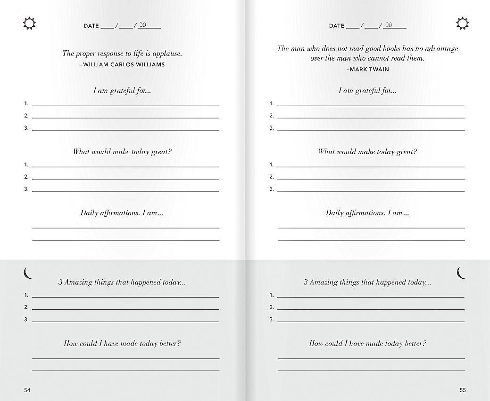
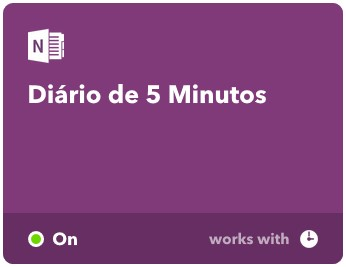

_"Querito tiário"_... assim eu costumava zombar dos meus amigos. Toda vez que revelavam manter um diário, eu fazia carão. Não que não visse valor no hábito de manter um registro pessoal, mas me parecia um hábito de adolescentes norte-americanos romantizado nas séries de TV dos anos 80-90, que permearam as programações do SBT.

Provavelmente Tiffany está muito ansiosa para escrever em seu querido diário todas as olhadas que recebeu de seu crush, Brandon, e em como acabará com a invejosa Karen.

Ledo engano...

> "A única coisa de que me arrependo sobre fazer diários é de ter esperado tanto tempo para começar." - Hal Elrod, _[O Milagre da Manhã](https://amzn.to/2KfKbBV)_

Meu preconceito me afastou de um dos hábitos mais construtivos e transformadores que um ser humano pode adotar por um custo praticamente zero. Tudo o que você precisa é de um caderno e uma caneta, ou um aplicativo que permita registrar notas, caso prefira, e alguns poucos minutos do dia.

Então no fim do ano de 2018, decidi iniciar com mais esse hábito na minha vida. Como já usava o OneNote como ferramenta de notas, decidi aproveitá-lo e criei um novo caderno para usar como diário.

Meu preconceito me afastou de um dos hábitos mais construtivos e transformadores que um ser humano pode adotar por um custo praticamente zero.

Quase todos os dias registrava o que tinha acontecido durante meu dia, e já nesse primeiro momento percebi uma coisa: sempre que escrevia sobre meu dia, conseguia ver mais claramente o que me deixava feliz e o que acabava com as minhas energias. Rapidamente saquei que escrever sobre o que eu sentia melhorava muito qualquer ansiedade ou angústia que me abatia.

Mas havia um problema...

## Se perdendo durante a escrita

Escrever levava muito de mim. Revisitar o que se sente é maravilhoso, se entende melhor o que se está sentindo, mas também te joga de volta em um mar de emoções, e às vezes é difícil extrair algo rapidamente e sair ileso. Não raro me perdia nos pensamentos. Meu cérebro me pregava armadilhas para não prosseguir com o desconfortável hábito de revisitar as pertubações emocionais.

Como alternativa, procurei algo que me ajudasse a focar no que deveria ser registrado para maximizar o tempo e as lições que poderia aprender sobre mim. E encontrei...

## O Diário de 5 minutos

O Diário de 5 minutos, citado no livro que estava lendo, [O Milagre da Manhã](https://amzn.to/2KfKbBV), de Hal Elrod, se encaixou perfeitamente no que eu procurava. Consiste em um registro realizado durante 2 períodos do dia: no **início do dia** e ao **final da noite**, em que você descreve:

### Manhã 🌞

- Pelo que você é grato(a)?
- O que faria do seu dia um grande dia?
- Sua afirmação diária (conceito tirado de [O Segredo - Rhonda Byrne](https://amzn.to/2Q5K3uq)

### Noite 🌜

- 3 coisas maravilhosas que aconteceram durante o dia
- Como você poderia ter tornado seu dia ainda melhor

Algo mais ou menos assim:

Em menos de 5 minutos, você exercita sua gratidão, estabelece seus objetivos em ações práticas, aguça a mente para prevenir a autossabotagem, mantém uma perspectiva positiva e construtiva antes de dormir e reavalia no que poderia melhorar. Não tem como se melhor e mais sucinto que isso.

Para facilitar o trabalho de manter o hábito diariamente com todas essas entradas para escrever, encontrei uma receito do IFTTT para automatizar isso.

## Automatizando com IFTTT e OneNote

Pesquisando um pouco sobre, encontrei uma receita no IFTTT que adicionava diariamente uma nota no OneNote já preenchida com um modelo do diário de 5 minutos, em inglês.

Sendo desenvolvedor web a alguns anos, não foi difícil adaptar o modelo para o português brasileiro (pt-BR), tampouco realizar modificações no limitado HTML suportado pelo OneNote vindo do IFTTT.

Você pode usar minha receita no link abaixo:

https://ifttt.com/applets/88355101d-diario-de-5-minutos

Se você não conhece o IFTTT, não tem problema, basta escolher o caderno e a seção que usará como diário.

Todo dia, você encontrará uma nota com um modelo em português do diário de 5 minutos.

## Conclusão

No início, nem sempre você acertará. Alguns dias pode ser que se esqueça de estabelecer seus objetivos durante a manhã. Ou quem sabe pule a aprendizagem durante a noite. Não tem problema. Não digo que sairá ileso(a), mas tudo bem. O importante é persistir e se permitir.

Se permitir lembrar porque acorda todos os dias e porque acordará no dia seguinte. Se permitir desarmar as armadilhas que a educação formal e o senso comum colocaram nas nossas mentes. Se permitir ser grato(a) por quem se tornou e por tudo e todos à sua volta. Se permitir se conhecer melhor e melhorar a sua qualidade de vida e dos outros à sua volta. Se permitir aprender todos os dias com os seus erros e acertos.

## Referências

[Diário de 5 minutos](https://www.intelligentchange.com/products/the-five-minute-journal)
